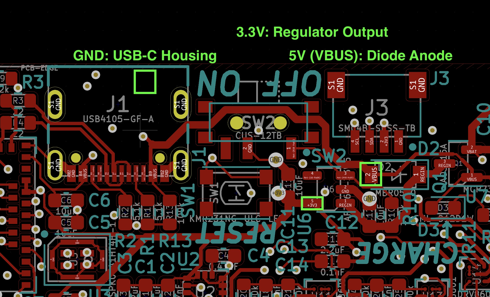

# umbelt-sw

## How to Run

Prerequisites: PlatformIO (PIO)

0. Install platformio with `pip install -U platformio` (create a virtualenv if desired). Alternate install options [here](https://docs.platformio.org/en/latest/core/installation.html).

First time setup:

1. Clone repository
2. Pull in submodules with `git submodule init` and `git submodule update`.
    (More on working with submodules [here](https://git-scm.com/book/en/v2/Git-Tools-Submodules).)
3. Clone [the Umbelt board support package (BSP)](https://github.com/cygann/Adafruit_nRF52_Arduino) as a sibling directory to `umbelt-sw`. This is a modified version of the BSP for the [Adafruit Feather Sense](https://www.adafruit.com/product/4516).
4. Run `pio run` in the `umbelt-sw` directory. This will download the Feather Sense BSP from PlatformIO's servers to PlatformIO's BSP install location, then fail to compile the Umbelt code because it's using this BSP instead of the Umbelt one.
5. Run `python variant_pre_build.py` to overwrite the Feather Sense BSP with the Umbelt BSP. If PIO ever reverts to the original config, which will manifest as the same compilation errors as in the previous step, just re-run this script.

Compiling, uploading to device, and monitoring serial output:

6. Compile with `pio run`.
7. Upload (and compile) with `pio run -t upload`.
8. Monitor serial activity with `pio device monitor`.

## Board Bringup

After soldering on components, it's useful to check the soldering of the motor drivers before adding the flex PCB. A test program which writes each motor output high then low repeatedly and a multimeter probing the high density connector on the board can be used to verify the soldering.

1. Solder components onto the rigid PCB
2. Do a basic electrical test
    a. Check that 5V and 3V3 are not shorted to ground

3. Flash the bootloader from [cygann/Adafruit_nRF52_Bootloader](https://github.com/cygann/Adafruit_nRF52_Bootloader) to the umbelt.
    a. Plug the board into 5V via the USB-C connector. Turn the switch to the `ON` position to enable the 3V regulator.
    b. Connect a J-Link to the SWD/debug port.
    c. Flash the bootloader with `make BOARD=feather_nrf52840_express flash`.
4. Upload the motor testing program with `pio run -t upload -e motortest`.
5. Use a multimeter in DC voltage mode to probe each thin pad on the high density flex connector with the other probe on GND. Check that each motor output swings a from 0 to 3.3V. If any outputs don't do this then the soldering of the corresponding motor driver probably needs to be fixed.

## Debug output

For debug outputs, we strongly recommend using a jlink debug probe with RTT (Real Time Transfer) instead of Arduino's
Serial library.

1. Install [JLink Commander](https://www.segger.com/downloads/jlink/) software.

2. Plug in a Segger JLink debug probe to your computer and connect the debug pins to the Umbelt board.

3. In a terminal, run `Jlinkexe -autoconnect 1 -Device NRF52840_XXAA -If SWD -Speed 400`. This establishes a connection to the target chip on the Umbelt board through the Jlink debug probe.

4. In another terminal window, run `JLinkRTTClient` to view the debug outputs.

[TODO] On the Umblet firmware side, write to RTT with the following:

